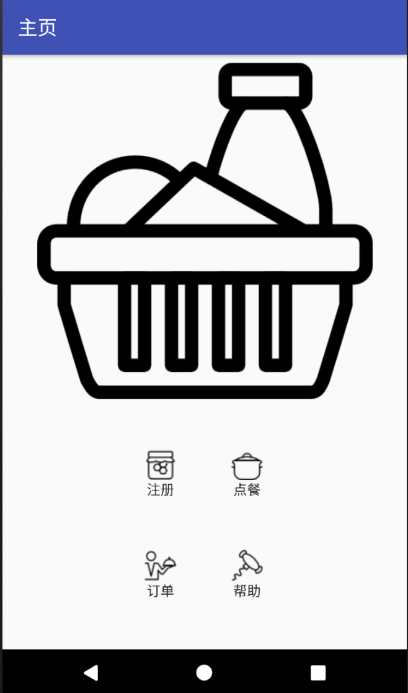
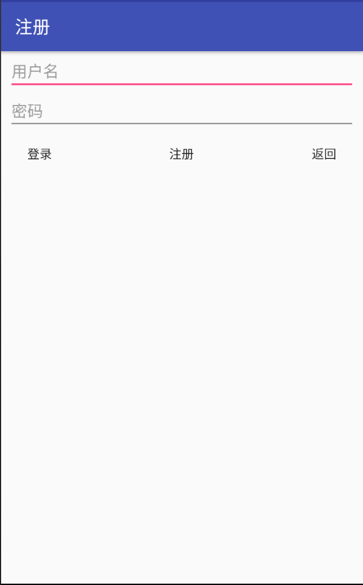
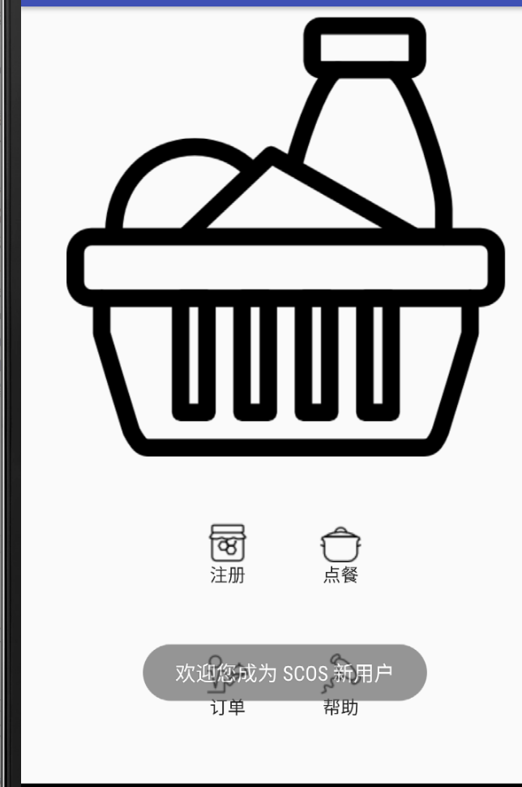
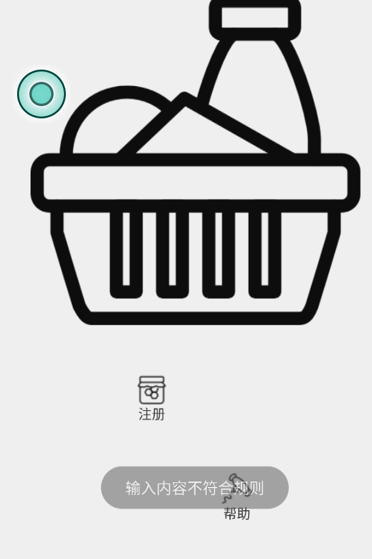

# Android应用软件设计
_E2  Intent and Intent Filter_

学号：SA18225428
姓名：许强

## 1.主题概述
>1.在第一次基础上进行扩展，建立名为MainScreen的类，并建立多个活动的交互，需要使用Intent与Intent-filter。

>2.修改名为Entry的类，支持手势滑动启动到主界面。

>3.修改Manifest文件添加属性。

>4.新建名为LoginOrRegister的类，用于登录或者注册，添加登录进度条，实现正则表达式，返回时测试返回值实现显示与隐藏的功能

>5.测试工程。


## 2.假设
> 1.java类文件的基础：Intent的使用方法，如何支持手势，如何在Intent添加Extras，如何设置Button的Visible属性，如何进行ProgressBar或ProgressDialog的使用。
> 
> 2.xml布局文件的基础：灵活使用LinearLayout、ConstraintLayout、RelativeLayout等布局方式，熟练使用Button、TextView、ImageView、EditText等控件的使用。
> 
> 3.必要时修改AndroidManifest文件，res目录下的资源文件。

## 3.实现或证明
>1.代码已上传至[GitHub](https://github.com/xq773939719/XQ-Android-SCOS)。
>
>2.Entry功能是左滑动进入MainScreen并显示四个图标，点击图标进入主页但是不显示俩图标，用于测试FromEntry是否到达MainScreen。
>
>3.实现了E2描述的全部功能。
>
>4.步骤:
>
```
1.设计MainScreen布局，在MainScreen类添加类用于创建活动，在Activity中的onCreate方法中设置监听按键，并在类内实现监听器的功能、实现手势切换Activity的功能，获取Intent的值，如果为FromEntry则设置其中两个按键显示，如果不是则隐藏，修改AndroidManifest文件，添加属性。
2.在LoginOrRegister中添加活动，用于注册登录活动，输入登录名与密码进行正则表达式匹配，如果符合则显示登录进度条2s，并跳转主界面，反之则输出Toast信息显示输入不合法，使用Intent传递Extras信息。点击返回按钮，也要跳转到主屏幕，并使用Intent传递Extras信息。
3.获得从主屏幕返回的Intent的信息，符合预期的String信息则查看按键的隐藏状态，如果LoginSuccess，则设置按键‘点菜’与‘查看订单’为可见。
```

5.关键代码
>1.在第一次基础上进行扩展，建立名为MainScreen的类，并建立多个活动的交互，需要使用Intent与Intent-filter。

```
package es.source.code.activity;

import android.content.Intent;
import android.os.Bundle;
import android.support.v7.app.AppCompatActivity;
import android.view.View;
import android.widget.Button;
import android.widget.ImageView;

import es.source.code.model.User;
import xq.scos.R;
public class MainScreen extends AppCompatActivity {
    private Button mLoginButton;
    private Button mOrderButton;
    private Button mMenuButton;
    private Button mHelpButton;
    private ImageView mHomeImage;
    public User user;

    @Override
    protected void onCreate(Bundle savedInstanceState) {
        super.onCreate(savedInstanceState);
        setContentView(R.layout.mainscreen);
        mLoginButton = (Button) findViewById(R.id.HomeLoginButton);
        mOrderButton = (Button) findViewById(R.id.HomeOrderButton);
        mMenuButton = (Button) findViewById(R.id.HomeMenuButton);
        mHelpButton = (Button) findViewById(R.id.HomeHelpButton);
        mHomeImage = (ImageView) findViewById(R.id.HomeLogo);

        Intent intent = getIntent();
        String string = intent.getStringExtra("from");

        if(string.isEmpty()){

        }

        if(string.equals("FromEntry")){

        }
        else{
            mOrderButton.setVisibility(View.INVISIBLE);
            mMenuButton.setVisibility(View.INVISIBLE);
        }
        if(string.equals("LoginSuccess")){
            if(mOrderButton.getVisibility()==View.INVISIBLE){
                mOrderButton.setVisibility(View.VISIBLE);
            }
            if(mMenuButton.getVisibility()==View.INVISIBLE){
                mMenuButton.setVisibility(View.VISIBLE);
            }
            user=(User)intent.getSerializableExtra("loginuser");
        }
        else if(string.equals("RegisterSuccess")) {
            if (mOrderButton.getVisibility() == View.INVISIBLE) {
                mOrderButton.setVisibility(View.VISIBLE);
            }
            if (mMenuButton.getVisibility() == View.INVISIBLE) {
                mMenuButton.setVisibility(View.VISIBLE);
            }
            user=(User)intent.getSerializableExtra("loginuser");
        }
        else{
            user = null;
        }

        setListeners();

    }
    private void setListeners(){
        OnClick onClick = new OnClick();
        mLoginButton.setOnClickListener(onClick);
        mOrderButton.setOnClickListener(onClick);
        mMenuButton.setOnClickListener(onClick);
        mHelpButton.setOnClickListener(onClick);
        mHomeImage.setOnClickListener(onClick);
    }

    private class OnClick implements View.OnClickListener{

        @Override
        public void onClick(View view){
            Intent intent = null;
            switch (view.getId()){
                case R.id.HomeLoginButton:
                    intent = new Intent(MainScreen.this,LoginOrRegister.class);
                    intent.putExtra("from","FromMain");
                    break;
                case R.id.HomeOrderButton:
                    intent = new Intent(MainScreen.this,FoodView.class);
                    intent.putExtra("from","FromMain");
                    break;
                case R.id.HomeMenuButton:
                    intent = new Intent(MainScreen.this,FoodOrderView.class);
                    intent.putExtra("from","FromMain");
                    break;
                case R.id.HomeHelpButton:
                    intent = new Intent(MainScreen.this,Help.class);
                    intent.putExtra("from","FromMain");
                    break;
                case R.id.HomeLogo:
                    intent = new Intent(MainScreen.this,SCOSEntry.class);
                    intent.putExtra("from","FromMain");
                    break;


            }
            startActivity(intent);

        }

    }

}

```

>2.修改名为Entry的类，支持手势滑动启动到主界面。

```
    package es.source.code.activity;

import android.content.Context;
import android.content.Intent;
import android.support.v7.app.AppCompatActivity;
import android.os.Bundle;
import android.view.GestureDetector;
import android.view.View;

import android.view.MotionEvent;
import android.widget.Toast;

import xq.scos.R;

public class SCOSEntry extends AppCompatActivity {

    private static final int MIN_DISTANCE = 50; // 最小滑动距离
    private static final int MIN_VELOCITY = 20; // 最小滑动速度
    GestureDetector mGestureDetector;

    @Override
    public boolean onTouchEvent(MotionEvent event) {
        return mGestureDetector.onTouchEvent(event);
    }

    GestureDetector.SimpleOnGestureListener mGestureListener = new GestureDetector.SimpleOnGestureListener() {
        public boolean onFling(MotionEvent e1, MotionEvent e2, float velocityX, float velocityY) {
            float x = e1.getX() - e2.getX();

            if (x > MIN_DISTANCE && Math.abs(velocityX) > MIN_VELOCITY) {
                showToast(getResources().getString(R.string.welcome));//显示欢迎

                Intent intent = new Intent(SCOSEntry.this,MainScreen.class);
                intent.putExtra("from","FromEntry");
                startActivity(intent);

                finish();
            }
            return false;
        }
    };//

    @Override
    protected void onCreate(Bundle savedInstanceState) {
        super.onCreate(savedInstanceState);
        setContentView(R.layout.entry);
        mGestureDetector = new GestureDetector(this, mGestureListener);
    }
    public void toMainscreen(View view){
        Intent intent = new Intent(this,MainScreen.class);
        intent.putExtra("from","FromEntryClick");
        startActivity(intent);
    }
    public void showToast(String input) {
        Toast.makeText(this, input, Toast.LENGTH_SHORT).show();
    }


}

```

>3.修改Manifest文件添加属性。

```
<?xml version="1.0" encoding="utf-8"?>
<manifest xmlns:android="http://schemas.android.com/apk/res/android"
    xmlns:tools="http://schemas.android.com/tools"
    package="xq.scos">

    <permission
        android:name="scos.permission.ACCESSSCOS"
        android:protectionLevel="dangerous" />

    <uses-permission android:name="android.permission.CALL_PHONE" />
    <uses-permission android:name="android.permission.SEND_SMS" />
    <uses-permission android:name="android.permission.INTERNET" />
    <uses-permission android:name="android.permission.RECEIVE_BOOT_COMPLETED" />

    <!-- To auto-complete the email text field in the login form with the user's emails -->
    <uses-permission android:name="android.permission.GET_ACCOUNTS" />
    <uses-permission android:name="android.permission.READ_PROFILE" />
    <uses-permission android:name="android.permission.READ_CONTACTS" />

    <application
        android:allowBackup="true"
        android:icon="@mipmap/icon"
        android:label="@string/app_name"
        android:roundIcon="@mipmap/icon"
        android:supportsRtl="true"
        android:theme="@style/AppTheme"
        tools:ignore="GoogleAppIndexingWarning">

        <activity android:name="es.source.code.activity.SCOSEntry">
            <intent-filter>
                <action android:name="android.intent.action.MAIN" />

                <category android:name="android.intent.category.LAUNCHER" />
            </intent-filter>
        </activity>

        <activity
            android:name="es.source.code.activity.MainScreen"
            android:label="@string/MainScreen"
            android:permission="scos.permission.ACCESSSCOS">
            <intent-filter>
                <action android:name="android.intent.action.SCOSMAIN" />

                <category android:name="android.intent.category.DEFAULT" />
                <category android:name="android.intent.category.SCOSLAUNCHER" />
            </intent-filter>
        </activity>
        <activity
            android:name="es.source.code.activity.Order"
            android:label="@string/order" />
        <activity
            android:name="es.source.code.activity.Help"
            android:label="@string/help" />
        <activity
            android:name="es.source.code.activity.LoginOrRegister"
            android:label="@string/log" />
        <activity
            android:name="es.source.code.activity.FoodOrderView"
            android:label="@string/title_food_order_view" />
        <activity
            android:name="es.source.code.activity.FoodDetailed"
            android:label="@string/title_activity_food_detial_view"
            android:parentActivityName="es.source.code.activity.FoodView"/>
        <activity
            android:name="es.source.code.activity.FoodView"
            android:label="@string/title_food_view"
            android:parentActivityName="es.source.code.activity.MainScreen">

        </activity>
    </application>
    </manifest>
```


>4.新建名为LoginOrRegister的类，用于登录或者注册，添加登录进度条，实现正则表达式，返回时测试返回值实现显示与隐藏的功能

```
package es.source.code.activity;


import android.app.ProgressDialog;
import android.content.Intent;
import android.os.Bundle;
import android.support.v7.app.AppCompatActivity;
import android.view.View;
import android.widget.Button;
import android.widget.EditText;
import android.widget.Toast;

import java.util.regex.Pattern;

import es.source.code.model.User;
import xq.scos.R;
public class LoginOrRegister extends AppCompatActivity {
    EditText etName;
    EditText etPassword;
    private Button mButton_Enter;
    private Button mButton_Login;
    private Button mButton_Return;
    private ProgressDialog progressDialog;

    private static final Pattern pattern = Pattern.compile("^[A-Za-z1-9_-]+$");

    @Override
    protected void onCreate(Bundle savedInstanceState) {
        super.onCreate(savedInstanceState);
        setContentView(R.layout.loginorregister);
        mButton_Enter = (Button)findViewById(R.id.enterButton);
        mButton_Login = (Button)findViewById(R.id.loginButton);
        mButton_Return = (Button)findViewById(R.id.returnButton);
        etName = (EditText)findViewById(R.id.userName);
        etPassword = (EditText)findViewById(R.id.userPassword);
        setListeners();


    }

    private void setListeners(){
        OnClick onClick = new OnClick();
        mButton_Enter.setOnClickListener(onClick);
        mButton_Login.setOnClickListener(onClick);
        mButton_Return.setOnClickListener(onClick);

    }
    private class OnClick implements View.OnClickListener{

        @Override
        public void onClick(View view){
            Intent intent = null;
            User loginUser = new User();
            switch (view.getId()){
                case R.id.enterButton:
                    showProgress(R.string.logining);
                    if(startValid()){
                        loginUser.setOldUser(true);
                        loginUser.setUserName(etName.getText().toString());
                        loginUser.setPassword(etPassword.getText().toString());
                        Toast.makeText(LoginOrRegister.this,"已登录",Toast.LENGTH_SHORT).show();
                        intent = new Intent(LoginOrRegister.this,MainScreen.class);
                        intent.putExtra("from","LoginSuccess");

                    }
                    else{
                        Toast.makeText(LoginOrRegister.this,"输入内容不符合规则",Toast.LENGTH_SHORT).show();
                        intent = new Intent(LoginOrRegister.this,MainScreen.class);
                        intent.putExtra("from","LoginFail");
                        dismissProgress();
                    }

                    break;

                case R.id.loginButton:
                    showProgress(R.string.registering);
                    loginUser.setOldUser(false);
                    loginUser.setUserName(etName.getText().toString());
                    loginUser.setPassword(etPassword.getText().toString());
                    Toast.makeText(LoginOrRegister.this,"欢迎您成为 SCOS 新用户",Toast.LENGTH_SHORT).show();
                    intent = new Intent(LoginOrRegister.this,MainScreen.class);
                    intent.putExtra("from","RegisterSuccess");
                    break;
                case R.id.returnButton:
                    intent = new Intent(LoginOrRegister.this,MainScreen.class);
                    intent.putExtra("from","Return");
                    break;

            }
            Intent intent_User = new Intent(LoginOrRegister.this,MainScreen.class);
            Bundle bundle = new Bundle();
            bundle.putSerializable("loginuser",loginUser);
            intent.putExtras(bundle);
            if(intent_User!=null) startActivity(intent_User);

            if(intent!=null) startActivity(intent);


        }

    }

    private boolean startValid() {
        return pattern.matcher(etName.getText().toString().trim()).matches() && pattern.matcher(etPassword.getText()
                .toString().trim()).matches();
    }

    protected void showProgress(int messageRes) {
        progressDialog = new ProgressDialog(this);
        progressDialog.setTitle(getResources().getString(R.string.app_name));
        progressDialog.setMessage(getResources().getString(messageRes));
        progressDialog.setCancelable(false);
        progressDialog.show();

    }
    protected void dismissProgress() {
        if (progressDialog.isShowing()) {
            progressDialog.dismiss();
        }
    }


}
```

## 4.结论
```
1.
protectionlevel的不同类型：name:权限的名字，即uses-permisson使用的。    
permissionGroup:权限的分类，在提示用户安装时会把某些功能差不多的权限放到一类。     
protectionLevel:分为Normal、Dangerous、Signature、SignatureOrSystem。     
label:提示给用户的权限名。     
description:提示给用户的权限描述。
(1)Normal    任何应用都可以申请，在安装应用时，不会直接提示给用户，点击全部才会展示。   
(2)Dangerous    任何应用都可以申请，在安装应用时，会直接提示给用户。    
(3)Signature    只有和该apk(定义了这个权限的apk)用相同的私钥签名的应用才可以申请该权限，即只有Android官方使用相同私钥签名的应用才可以申请该权限。    
(4)SignatureOrSystem    有两种应用可以申请该权限。    
1)和该apk(定义了这个权限的apk)用相同的私钥签名的应用    2)在/system/app目录下的应用
```
```
2.
2.1
<intent-filter . . . >
    <action android:name="com.example.project.SHOW_CURRENT" />
    <action android:name="com.example.project.SHOW_RECENT" />
    <action android:name="com.example.project.SHOW_PENDING" />
    . . .
</intent-filter>
```
```
当一个intent对象只能命名一个单一的action，一个过滤器则可以列出多个action。这个列表也可以是空的， 一个过滤器必须包含一个 <action> element ,否则它将阻止所有的intents要通过这个测试，在intent被指定的action必须匹配在过滤器中所列的action的其中之一。如果一个intent对象或者过滤器没有指定action。 结果如下 : 
如果一个filter 没有指定任何action ,那么则没有任何intent会被匹配。所以，所有的intent将不会通过此测试。
另一方面，如果一个intent对象没有指定任何action，那么将自动通过此测试—只要这个过滤器中有至少一个action.
```
```
2.2
<intent-filter . . . > 
    <category android:name="android.intent.category.DEFAULT" /> 
    <category android:name="android.intent.category.BROWSABLE" /> 
    . . . 
</intent-filter>
```
```
要通过category测试， Intent对象中包含的每个category必须匹配filter中的一个。Filter可以列出额外的category，但是不能漏掉 intent 对象包含的任意一个category。 原则上，一个没有任何categorys的 Intent object 将总是通过此测试。大多数情况下是正确的。然而，也有例外，android对待所有传入 startActivity（） 中的隐式视图，都认为它们至少包含了一个 category --- "android.intent.category.DEFAULT". . 因此，希望接收这些隐式意图的activities必须在在它们的 intent filters 中包含”android.intent.category.DEFAULT” ..有（对于含"android.intent.action.MAIN" and "android.intent.category.LAUNCHER"的filter 则是例外。因为它们标记了此activity开启了一个新的task 和 将出现在 auncher screen。它们也可以包含“com.intent.category.DEFAULT”,但没必要）
```
```
2.3
<intent-filter . . . > 
    <data android:mimeType="video/mpeg" android:scheme="http" . . . /> 
    <data android:mimeType="audio/mpeg" android:scheme="http" . . . /> 
    . . . 
</intent-filter>
```
```
a) 如果一个intent没有指定uri和data type,那么如果filter中也是同样，则通过测试。 
b) 如果一个uriintent有uri但是没有data type(或者是data type不能从uri中推断出来 )只能通过这样的filter:uri匹配,并且不指定类型. 这种情况限于类似mailto:和tel:这样的不指定实际数据的uri. 
c) 如果一个intent 包含data type但是没有uri,那么filter中列出相同的data type并且没有指定uri则通过测试。 
d) 如果一个intent包含一个uri和data type(或者data type 可以从uri中推断出来)，那么filter列出的有相同data type,intent对象的uri要么和filter中的uri匹配,要么intent的uri为content:or file:并且filter不指定uri
e)如果一个Intent可以通过多个activity或者filter的filter，那么用户将会被询问需要激活哪个组件。 如果一个都没有的话，将会抛出异常。 
```
```
android.intent.action.MAIN决定一个应用程序最先启动那个组件
android.intent.category.LAUNCHER决定应用程序是否显示在程序列表里(说白了就是是否在桌面上显示一个图标)
intent-filter匹配优先级，按照以下优先关系查找：action->data->category
```
## 5.参考

##### 参考书籍

`【1】《Head First Android开发》`

`【2】《Android第一行代码》`

`【3】《Head First Java》`

`【4】《Java编程思想》`

##### 参考链接
【1】[Android的视频教程](https://www.bilibili.com/video/av18008899)

【2】[提供帮助的社区](https://www.jianshu.com/)

【3】[技术博客CSDN](https://blog.csdn.net/jltxgcy/article/details/48288467)

【4】[技术博客开源中国](https://www.oschina.net/question/157182_45601)


#####附图
>
>
>
>
>