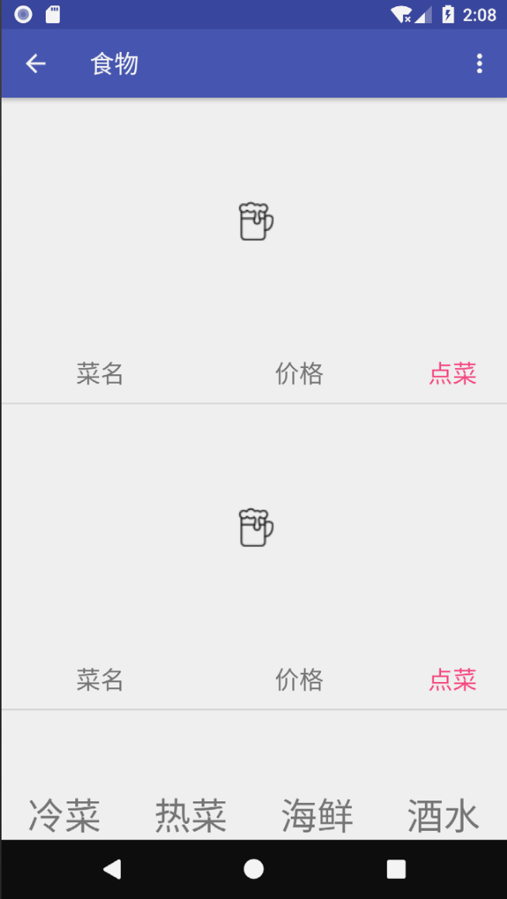
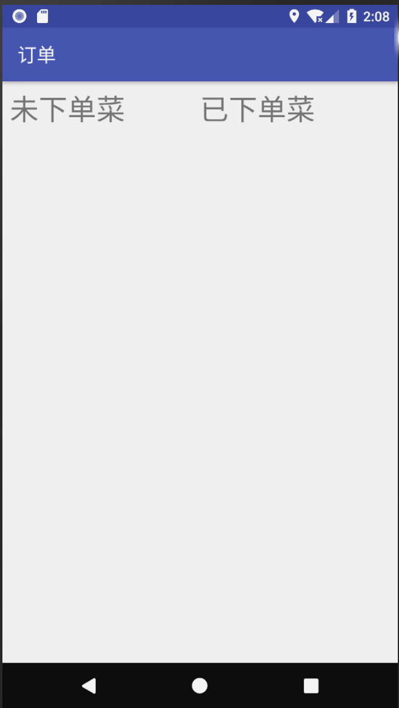
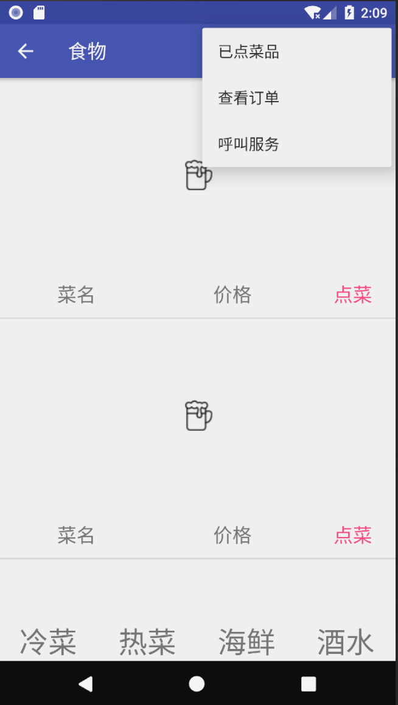

# Android应用软件设计
_E3  Adapter View_

学号：SA18225428
姓名：许强

## 1.主题概述
>1.使用GridView重构主页导航
将MainScreen中的导航按钮使用GridView实现。

>2.添加点餐页面，学会使用ListView实现点餐和退点功能。并添加订单页面和菜品详情页面。

>3.在不同页面之间实现对象传值
通过Intent来实现相互跳转。并在其中插入自定义的对象.

>4.打包签名生成软件版本2.0
在manifest文件中定义版本，使用AS的打包工具打包并签名。

## 2.假设
> 用户需要进入点餐列表和菜品详情进行点餐，并从查看订单页面来进行结账。
同时，我们要实现打折功能，对于老用户我们应该做到检测优惠。

## 3.实现或证明
>1.代码已上传至[GitHub](https://github.com/xq773939719/XQ-Android-SCOS)。
>
>2.目前实现部分E3所述的功能，包括：1)界面是GridLayout布局，不是GridView布局，后期需要加入适配器重构代码。2)User类。3)实现了LoginOrRegister的注册登录验证功能。4)MainScreen接受LoingOrRegister数据判断功能。5)FoodView的ListView显示，还没有加入Fragment功能。6)FoodOrder没有加入Fragment功能。7)FoodDetialView没有加入Fragment功能。8)没有实现新老顾客优惠功能。
>
>4.步骤:
>
>①在布局中使用GridLayout，后续需要改为GridView，并添加适配器。
>
>②添加User类。
>
>③添加注册与登录按键，正则表达式验证输入，传出数据与Itent，并使用Toast提示用户。
>
>
>④MainScreen使用User接收LoginOrRegister传回的数据，并显示其中俩个按键。
>
>⑤添加了ListView和ListView适配器，仅仅显示静态的菜品视图，后期还需要编写代码实现Fragment和Adapter的配合。
>⑥有些部分还没有实现。


5.关键代码
>
>1.注册登录功能实现了注册登录验证功能，并Toast提示用户。
>

```
public class LoginOrRegister extends AppCompatActivity {
    EditText etName;
    EditText etPassword;
    private Button mButton_Enter;
    private Button mButton_Login;
    private Button mButton_Return;
    private ProgressDialog progressDialog;

    private static final Pattern pattern = Pattern.compile("^[A-Za-z1-9_-]+$");

    @Override
    protected void onCreate(Bundle savedInstanceState) {
        super.onCreate(savedInstanceState);
        setContentView(R.layout.loginorregister);
        mButton_Enter = (Button)findViewById(R.id.enterButton);
        mButton_Login = (Button)findViewById(R.id.loginButton);
        mButton_Return = (Button)findViewById(R.id.returnButton);
        etName = (EditText)findViewById(R.id.userName);
        etPassword = (EditText)findViewById(R.id.userPassword);
        setListeners();


    }

    private void setListeners(){
        OnClick onClick = new OnClick();
        mButton_Enter.setOnClickListener(onClick);
        mButton_Login.setOnClickListener(onClick);
        mButton_Return.setOnClickListener(onClick);

    }
    private class OnClick implements View.OnClickListener{

        @Override
        public void onClick(View view){
            Intent intent = null;
            User loginUser = new User();

            switch (view.getId()){
                case R.id.enterButton:

                    if(startValid()){

                        loginUser.setOldUser(true);
                        loginUser.setUserName(etName.getText().toString());
                        loginUser.setPassword(etPassword.getText().toString());
                        showProgress(R.string.logining);
                        Handler handler = new Handler();
                        handler.postDelayed(new Runnable() {
                            @Override
                            public void run() {
                                dismissProgress();
                            }
                        }, 2000);
                        Toast.makeText(LoginOrRegister.this,"已登录",Toast.LENGTH_SHORT).show();
                        intent = new Intent(LoginOrRegister.this,MainScreen.class);
                        intent.putExtra("from","LoginSuccess");


                    }
                    else{
                        Toast.makeText(LoginOrRegister.this,"输入内容不符合规则",Toast.LENGTH_SHORT).show();
                        intent = new Intent(LoginOrRegister.this,MainScreen.class);
                        intent.putExtra("from","LoginFail");
                        dismissProgress();
                    }

                    break;

                case R.id.loginButton:
                    showProgress(R.string.registering);
                    if(startValid()){
                        loginUser.setOldUser(false);
                        loginUser.setUserName(etName.getText().toString());
                        loginUser.setPassword(etPassword.getText().toString());
                        Toast.makeText(LoginOrRegister.this,"欢迎您成为 SCOS 新用户",Toast.LENGTH_SHORT).show();
                        intent = new Intent(LoginOrRegister.this,MainScreen.class);
                        intent.putExtra("from","RegisterSuccess");
                    }
                    else{
                        Toast.makeText(LoginOrRegister.this,"输入内容不符合规则",Toast.LENGTH_SHORT).show();
                        intent = new Intent(LoginOrRegister.this,MainScreen.class);
                        intent.putExtra("from","RegisterFail");
                    }

                    break;
                case R.id.returnButton:
                    intent = new Intent(LoginOrRegister.this,MainScreen.class);
                    intent.putExtra("from","Return");
                    break;

            }
            Intent intent_User = new Intent(LoginOrRegister.this,MainScreen.class);
            Bundle bundle = new Bundle();
            bundle.putSerializable("loginuser",loginUser);
            intent.putExtras(bundle);
            if(intent_User!=null) startActivity(intent_User);

            if(intent!=null) startActivity(intent);


        }

    }

    private boolean startValid() {
        return pattern.matcher(etName.getText().toString().trim()).matches() && pattern.matcher(etPassword.getText()
                .toString().trim()).matches();
    }

    protected void showProgress(int messageRes) {
        progressDialog = new ProgressDialog(this);
        progressDialog.setTitle(getResources().getString(R.string.app_name));
        progressDialog.setMessage(getResources().getString(messageRes));
        progressDialog.setCancelable(false);
        progressDialog.show();

    }
    protected void dismissProgress() {
        if (progressDialog.isShowing()) {
            progressDialog.dismiss();
        }
    }


}

```
>
>2.MainScreen接受LoingOrRegister数据判断功能。
>

```
public class MainScreen extends AppCompatActivity {
    private Button mLoginButton;
    private Button mOrderButton;
    private Button mMenuButton;
    private Button mHelpButton;
    private ImageView mHomeImage;
    public User user;

    @Override
    protected void onCreate(Bundle savedInstanceState) {
        super.onCreate(savedInstanceState);
        setContentView(R.layout.mainscreen);
        mLoginButton = (Button) findViewById(R.id.HomeLoginButton);
        mOrderButton = (Button) findViewById(R.id.HomeOrderButton);
        mMenuButton = (Button) findViewById(R.id.HomeMenuButton);
        mHelpButton = (Button) findViewById(R.id.HomeHelpButton);
        mHomeImage = (ImageView) findViewById(R.id.HomeLogo);

        Intent intent = getIntent();
        String string = intent.getStringExtra("from");

        if(string.isEmpty()){

        }

        if(string.equals("FromEntry")){

        }
        else{
            mOrderButton.setVisibility(View.INVISIBLE);
            mMenuButton.setVisibility(View.INVISIBLE);
        }
        if(string.equals("LoginSuccess")){
            if(mOrderButton.getVisibility()==View.INVISIBLE){
                mOrderButton.setVisibility(View.VISIBLE);
            }
            if(mMenuButton.getVisibility()==View.INVISIBLE){
                mMenuButton.setVisibility(View.VISIBLE);
            }
            user=(User)intent.getSerializableExtra("loginuser");
        }
        else if(string.equals("RegisterSuccess")) {
            if (mOrderButton.getVisibility() == View.INVISIBLE) {
                mOrderButton.setVisibility(View.VISIBLE);
            }
            if (mMenuButton.getVisibility() == View.INVISIBLE) {
                mMenuButton.setVisibility(View.VISIBLE);
            }
            user=(User)intent.getSerializableExtra("loginuser");
        }
        else{
            user = null;
        }

        setListeners();

    }
    private void setListeners(){
        OnClick onClick = new OnClick();
        mLoginButton.setOnClickListener(onClick);
        mOrderButton.setOnClickListener(onClick);
        mMenuButton.setOnClickListener(onClick);
        mHelpButton.setOnClickListener(onClick);
        mHomeImage.setOnClickListener(onClick);
    }

    private class OnClick implements View.OnClickListener{

        @Override
        public void onClick(View view){
            Intent intent = null;
            switch (view.getId()){
                case R.id.HomeLoginButton:
                    intent = new Intent(MainScreen.this,LoginOrRegister.class);
                    intent.putExtra("from","FromMain");
                    break;
                case R.id.HomeOrderButton:
                    intent = new Intent(MainScreen.this,FoodView.class);
                    intent.putExtra("from","FromMain");
                    break;
                case R.id.HomeMenuButton:
                    intent = new Intent(MainScreen.this,FoodOrderView.class);
                    intent.putExtra("from","FromMain");
                    break;
                case R.id.HomeHelpButton:
                    intent = new Intent(MainScreen.this,Help.class);
                    intent.putExtra("from","FromMain");
                    break;
                case R.id.HomeLogo:
                    intent = new Intent(MainScreen.this,SCOSEntry.class);
                    intent.putExtra("from","FromMain");
                    break;


            }
            startActivity(intent);

        }

    }

}

```
>
>3.FoodView的ListView显示，还没有加入Fragment功能。
>
>

```
public class FoodView extends AppCompatActivity {
    private static final int MIN_DISTANCE = 50; // 最小滑动距离
    private static final int MIN_VELOCITY = 20; // 最小滑动速度
    User user;
    private FoodViewFragment foodViewFragment;
    public static int mPosition = 0;
    private FoodViewAdapter foodViewAdapter;
    private ListView mListView;
    GestureDetector mGestureDetector;
    @Override
    protected void onCreate(Bundle savedInstanceState) {
        super.onCreate(savedInstanceState);
        setContentView(R.layout.food_view);
        mGestureDetector = new GestureDetector(this, mGestureListener);
        //适配器与回收视图暂时不用
        /*getFragmentManager().addOnBackStackChangedListener(new FragmentManager.OnBackStackChangedListener() {
            @Override
            public void onBackStackChanged() {
                if(fragment instanceof FoodViewFragment){
                    currentPosition = 1;
                }
            }
        });*/

        //适配器与列表视图
        mListView = (ListView)findViewById(R.id.food_view_lv_1);
        mListView.setAdapter(new ListViewAdapter(FoodView.this));
        mListView.setOnItemClickListener(new AdapterView.OnItemClickListener() {
            @Override
            public void onItemClick(AdapterView<?> parent, View view, int position, long id) {
                Toast.makeText(FoodView.this,"短pos:"+position,Toast.LENGTH_SHORT);
            }
        });
        mListView.setOnItemLongClickListener(new AdapterView.OnItemLongClickListener() {
            @Override
            public boolean onItemLongClick(AdapterView<?> parent, View view, int position, long id) {
                Toast.makeText(FoodView.this,"长pos:"+position, Toast.LENGTH_LONG);
                return true;
            }
        });


    }
    private void selectItem(int position){
        mPosition = position;
        Fragment fragment;
        switch (position){
            case 1:
                fragment = new FoodViewFragment();
                break;

        }
        FragmentTransaction ft = getFragmentManager().beginTransaction();
        ft.commitAllowingStateLoss();

    }


    @Override
    public boolean onCreateOptionsMenu(Menu menu) {
        getMenuInflater().inflate(R.menu.menu_food_view,menu);
        return super.onCreateOptionsMenu(menu);
    }

    @Override
    public boolean onOptionsItemSelected(MenuItem item) {
        Intent intent = null;
        switch(item.getItemId()){
            case R.id.orderedfood:
                //
                intent = new Intent(FoodView.this,FoodOrderView.class);
                startActivity(intent);

                break;
            case R.id.listmenu:
                //
                intent = new Intent(FoodView.this,FoodOrderView.class);
                startActivity(intent);

                break;
            case R.id.service:
                intent = new Intent(Intent.ACTION_DIAL,Uri.parse("tel:"+120));
                startActivity(intent);
            default:
                //
                intent = new Intent(FoodView.this,MainScreen.class);
                intent.putExtra("from","FromFoodView");
                startActivity(intent);
                //return super.onOptionsItemSelected(item);

        }
    return true;

    }

    @Override
    public boolean onTouchEvent(MotionEvent event) {
        return mGestureDetector.onTouchEvent(event);
    }

    GestureDetector.SimpleOnGestureListener mGestureListener = new GestureDetector.SimpleOnGestureListener() {
        public boolean onFling(MotionEvent e1, MotionEvent e2, float velocityX, float velocityY) {
            float x = e1.getX() - e2.getX();

            if (x>0&&x > MIN_DISTANCE && Math.abs(velocityX) > MIN_VELOCITY) {
                Intent intent = new Intent(FoodView.this,FoodDetailed.class);
                intent.putExtra("from","FromFoodView");
                startActivity(intent);
            }
            else if (x<0&& -x > MIN_DISTANCE && Math.abs(velocityX) > MIN_VELOCITY) {
                Intent intent = new Intent(FoodView.this,MainScreen.class);
                intent.putExtra("from","FromFoodView");
                startActivity(intent);

            }
            finish();
            return false;
        }
    };//


}


```

## 4.结论
>
>本次实验继续E2的需求，在E2基础上需要添加Adapter和Fragment实现功能,现在还没有弄懂，所以编写代码有点困难。后面需要参考一下其他人代码，有时候对于复杂的逻辑应该找人讨论下比较好。
>本次实验学会了ListView的初步实现，本来想用的RecyclerView因为初学不大会用，所以需要后面重点研究一下。
>对UI没有重点修改，还需要把UI重新设置一下。

## 5.参考

##### 参考书籍

`【1】《Head First Android开发》`

`【2】《Android第一行代码》`

`【3】《Head First Java》`

`【4】《Java编程思想》`

##### 参考链接
【1】[Android的视频教程](https://www.bilibili.com/video/av18008899)

【2】[提供帮助的社区](https://www.jianshu.com/)

【3】[技术博客CSDN](https://blog.csdn.net/jltxgcy/article/details/48288467)

【4】[技术博客开源中国](https://www.oschina.net/question/157182_45601)


#####附图
>
>
>
>
>